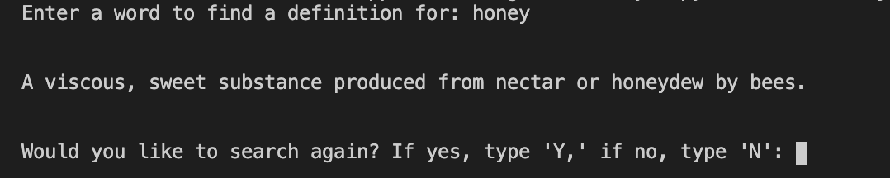

# User Friendly Interactive Dictionary

The program begins with a prompt to enter a word to find the definition for. It will then take that input and depending on what the user entered. Input is not case sensitive.

Scenario #1: Input spelt correctly

