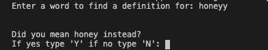
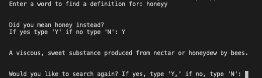
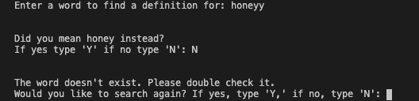
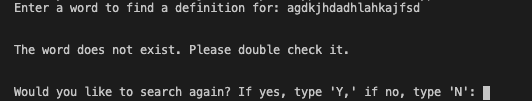
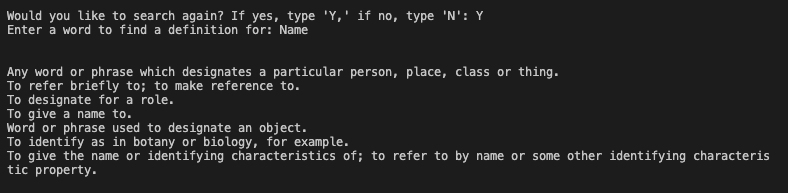
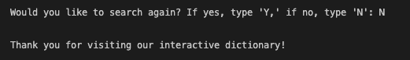

# User Friendly Interactive Dictionary

The program begins with a prompt to enter a word to find the definition for. It will then take that input and depending on what the user entered, will give the definition or ask further questions to find the correct word to define. Input is not case sensitive.

Scenario #1: If input is spelt correctly, the definitions will be printed on the next line. 

Scenario #2: If input is not spelt correctly, as long as it is spelt 60% similar to the word you were looking for, the program will provide the closest option in the dictionary to what was inputted. It will then ask if the closest option is the word the user was searching for. 

If the word is what the user wanted to find the definition for, they would confirm with a 'y' (not case sensitive), then the program would provide the definitions.

If the word is not what the user wanted to find the definition for, they would confirm with a 'n' (not case sensitive), then the program will provide a message to say the word does not exist.

Scenario #3: If the input is spelt with no similarity to any of the words in the dictionary, then the program will provide a message to say the word doesn't exist.

The program will then, no matter the scenario, come with a follow up message if the user wants to search for another word. If confirmed with a 'y' then the program will then again prompt the user to enter word to find the definition for.

Notice if there are multiple definitions for the same word then the following definition will be printed on the next line.

If the user then wants to end the program, they would enter a 'n' then the program will end with a thank you for visiting message.

